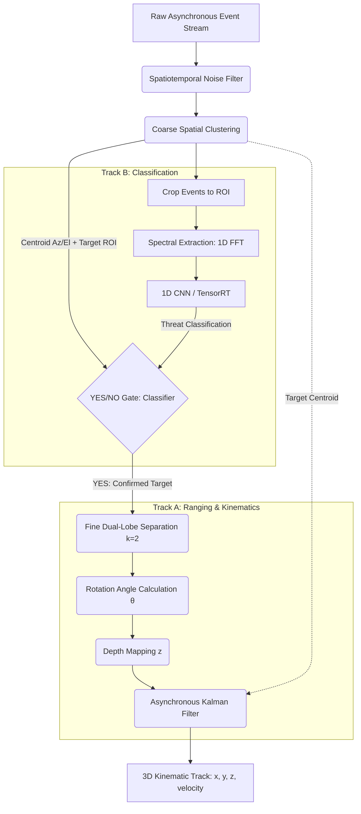

# Predator: Compact Event Camera Drone Detection Pipeline

This document outlines the technical specification and implementation plan for building the event camera data processing software pipeline to detect, classify, and track long-range drones using a Double-Helix Point Spread Function (DH-PSF) phase mask. 

The build is designed for NVIDIA DGX Spark (training) and will transition to the NVIDIA Jetson Orin NX 16GB (edge deployment).

## User Review Required

> [!IMPORTANT]
> **Language Selection Approval:** Per global rules, blind defaulting to Python is prohibited. We propose a hybrid architecture:
> - **C++ / CUDA** for the high-frequency Front-End (Time Surfaces, GMM Clustering) and Tracking math (EKF, Geometric mapping).
> - **Python (PyTorch) / TensorRT** for training the 1D CNN classifier on the DGX and deploying optimized models to the Orin NX.
> - **Rust** as the high-level system orchestrator for safe concurrent memory management of the data pipelines, if desired, though C++ is acceptable. (We will default to C++ for the orchestrator unless Rust is preferred). 

> [!WARNING]
> **Data Availability:** We will need simulated datasets (e.g., applying our specific DH-PSF to EVPropNet/FRED datasets) before we can train the 1D CNN classifier. Is there a timeline for generating this simulated data, or should we build the simulation scripts as part of Phase 3?

## Open Questions

> [!TIP]
> 1. Do we already have raw event streams recorded from the IDS IMX636 camera to build the C++ Time Surface and Clustering algorithms against, or will we rely on standard ROS bags (e.g., Prophesee datasets) for initial development?
> 2. Should we leverage ROS2 for node communication, or build a custom zero-copy memory pipeline for maximum performance on the Orin NX? (A custom pipeline is recommended for strict SWaP optimization).

---

## Proposed Pipeline Architecture

Based on the Scheimpflug principles and DH-PSF engineering research, the pipeline requires two independent branches gated by classification to conserve compute.

---

## Implementation Phases

### Phase 1: Core Framework & Front-End Filtering
**Language:** C++ / CUDA
**Focus:** Handling the raw microsecond event stream and filtering noise.
* Build the base event ingestion engine to read streams (from file or live sensor).
* Implement the Spatiotemporal Noise Filter using a Decaying Time Surface (Surface of Active Events) to isolate high-frequency rotor flicker.
* Implement Coarse Spatial Clustering (DBSCAN or Density Filter) to generate bounding boxes (ROIs) and Azimuth/Elevation centroids.

### Phase 2: Classification Branch (Micro-Doppler)
**Language:** Python (Training on DGX) / C++ TensorRT (Edge Inference)
**Focus:** Determining what the object is based on its frequency signature.
* Develop the event cropping mechanism to isolate the ROI.
* Implement Spectral Extraction using a CUDA-accelerated Non-Uniform Discrete Fourier Transform (NDFT) or sliding-window 1D FFT on the event rate.
* Design and train a lightweight 1D CNN (on the NVIDIA DGX Spark) to classify the harmonic signatures (e.g., Quadcopter vs. Bird).
* Compile the classifier to TensorRT for the edge environment.

### Phase 3: The Conditional Execution Gate
**Language:** C++
**Focus:** Orchestrating the pipeline logic.
* Implement the YES/NO logic gate. 
* Route the Coarse Target ROI exclusively into the Tracking Branch *only* if the Classifier yields a positive threat identification.

### Phase 4: Tracking Branch (Geometric Ranging)
**Language:** C++ (Eigen)
**Focus:** Calculating the 3D position of confirmed targets.
* Implement Fine Dual-Lobe Separation using a 2-component Gaussian Mixture Model (GMM) restricted to the active ROI.
* Implement Rotation Angle Calculation ($\theta = \text{arctan2}(y_2 - y_1, x_2 - x_1)$) ensuring phase unwrapping over time.
* Implement Depth Mapping using the empirical polynomial calibration function ($z = f(\theta)$).
* Build the Asynchronous Extended Kalman Filter (EKF) to ingest depth ($z$) and front-end centroid (Az/El) to smooth the 3D state vector.

### Phase 5: Hardware Optimization & Deployment
* End-to-end integration of all phases.
* Profiling memory bandwidth and tensor core utilization on the target NVIDIA Jetson Orin NX hardware.

---

## Verification Plan

### Automated Tests
- `test_noise_filter`: Inject synthetic noise events and verify the Time Surface correctly drops them.
- `test_clustering`: Provide a simulated dual-lobe event cluster and verify bounding box accuracy.
- `test_rotation_math`: Feed synthetic $(x_1, y_1), (x_2, y_2)$ coordinates to verify $\theta$ calculation and un-wrapping logic.

### Manual Verification
- Deploy the pipeline on the DGX Spark using pre-recorded event camera datasets (e.g., EVPropNet or FRED datasets with synthetically applied DH-PSF).
- Visually verify the target classification and 3D bounding box tracking via a custom visualization tool before transitioning to the Orin NX.
