# Orin Nano Live Deployment Implementation Plan

## Executive Summary
This document defines the deployment plan for transferring the event-based propeller detection pipeline (`ev_ingestion`), the IDS GenTL hardware bridge, and neural network weights to a live **NVIDIA Jetson Orin Nano 8GB** (running JetPack 6.1).

---

## 1. System Architecture & Component Inventory

```mermaid
flowchart LR
    subgraph Hardware Layer
        CAM["IDS UE-39B0XCP-E (IMX636)"] -- "USB 3.0" --> JETSON["Orin Nano 8GB (JetPack 6.1)"]
    end

    subgraph Driver & Bridge Layer
        GEN["IDS GenTL Producer (ids_u3vgentl.cti)"]
        OPENEB["OpenEB 5.2.0 HAL & Stream Libraries"]
    end

    subgraph Runtime Pipeline
        INGEST["ev_ingestion (C++ Binary)"]
        SLICE["10ms Slice Accumulator (10,000 µs)"]
        TENSOR["2-Channel Spatial Tensor [1, 2, 720, 1280]"]
        INFER["EVPropNet (LibTorch / ONNX Runtime / TensorRT)"]
    end

    JETSON --> GEN
    GEN --> OPENEB
    OPENEB --> INGEST
    INGEST --> SLICE
    SLICE --> TENSOR
    TENSOR --> INFER
```



### Artifacts to Deploy:
1. **Ingestion Executable & Shared Libraries**:
   - `ev_ingestion` binary (ARM64 ELF compiled under JetPack 6.1 / GCC 11).
   - Metavision / OpenEB 5.2.0 shared libraries (`libmetavision_stream.so`, `libmetavision_core.so`, `libmetavision_hal.so`).
2. **Hardware Bridge**:
   - `ids-peak-with-ueyetl_26.06.1-807_arm64` (GenTL producer: `ids_u3vgentl.cti`).
   - USB `udev` permission rules (`99-ids-usb-access.rules`).
3. **Model Weights**:
   - `evpropnet.pt` (TorchScript for LibTorch) or `evpropnet.onnx` (for ONNX Runtime / TensorRT).

---

## 2. Phased Implementation Steps

### Phase 1: Orin Nano Target Preparation
- **Goal**: Verify JetPack environment, CUDA stack, and USB 3.0 subsystem.
- **Verification Commands (on Orin Nano)**:
  ```bash
  # Check JetPack L4T version (Expect: R36.x / JetPack 6.x)
  cat /etc/nv_tegra_release
  
  # Check CUDA version (Expect: 12.2 / 12.6)
  nvcc --version
  
  # Ensure USB 3.0 port negotiation
  lsusb -t
  ```

### Phase 2: Hardware Driver & GenTL Bridge Installation
- **Goal**: Register the IDS GenTL transport layer and install USB permission rules so the camera is recognized without root privileges.
- **Actions**:
  1. Transfer `ids-peak-with-ueyetl_26.06.1_arm64.tar.gz` to `/opt/ids-peak/`.
  2. Install `99-ids-usb-access.rules` to `/etc/udev/rules.d/` and reload udev:
     ```bash
     sudo cp lib/udev/rules.d/99-ids-usb-access.rules /etc/udev/rules.d/
     sudo udevadm control --reload-rules && sudo udevadm trigger
     sudo usermod -aG dialout,video $USER
     ```
  3. Export GenTL producer path in user profile:
     ```bash
     export GENICAM_GENTL64_PATH=/opt/ids-peak/lib/aarch64-linux-gnu/ids-peak/cti
     ```

### Phase 3: OpenEB Runtime Libraries Deployment
- **Goal**: Provide the shared libraries needed by the `ev_ingestion` executable.
- **Actions**:
  - Sync `/usr/local/lib/libmetavision*` and `/usr/local/lib/libhdf5_ecf_codec*` from the DGX build container to `/usr/local/lib/` on the Orin Nano.
  - Run `sudo ldconfig` on the Orin Nano.

### Phase 4: Artifact Transfer & Model Ingestion
- **Goal**: Deliver the compiled binary and model weights to the target workspace.
- **Target Layout on Orin Nano**:
  ```text
  ~/ev_deploy/
  ├── bin/
  │   └── ev_ingestion
  ├── models/
  │   ├── evpropnet.pt
  │   └── evpropnet.onnx
  ├── env.sh
  └── run_pipeline.sh
  ```

### Phase 5: Live Hardware Ingestion & Range Validation
- **Goal**: Execute real-time streaming, slice accumulation, and inference validation.
- **Runbook**:
  ```bash
  source ~/ev_deploy/env.sh
  cd ~/ev_deploy/bin
  ./ev_ingestion ../models/evpropnet.pt
  ```
- **Validation Metrics**:
  - Asynchronous event throughput (Target: > 10M events/sec capacity).
  - 10ms slice generation rate (Target: 100 Hz output loop).
  - End-to-end inference latency on Orin Nano GPU (Target: < 8ms per batch).

---

## 3. Automated Deployment Script (`deploy_to_orin.ps1`)

We will provide an automated PowerShell deployment script that packages the local Windows artifacts, pulls the compiled binaries from the DGX build server, and provisions the Orin Nano over SSH in a single command.

---

## 4. Risk Mitigation & Edge Cases

| Potential Issue | Root Cause | Mitigation / Recovery |
| :--- | :--- | :--- |
| **Camera not detected** (`CameraException`) | Missing GenTL path or USB permissions | Verify `GENICAM_GENTL64_PATH` points directly to `ids_u3vgentl.cti`. Verify user is in `video` group. |
| **Missing shared library** (`libmetavision_*.so`) | Dynamic linker cannot find OpenEB | Check `ldd ev_ingestion` and update `LD_LIBRARY_PATH` or run `sudo ldconfig`. |
| **CUDA out of memory on Nano** | Default batch allocation too large for unified memory | Use FP16 half-precision tensor conversion in C++ pipeline to halve VRAM footprint. |
