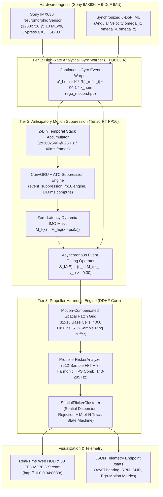

# Predator Neuromorphic Counter-UAS: Ego-Motion Compensation & Anticipatory Dynamic Suppression Walkthrough

**Target Platform**: NVIDIA Jetson Orin Nano Developer Kit (8GB RAM, Ampere GPU, JetPack 6.2, L4T R36.4.4, CUDA 12.6, TensorRT 10.3)  
**Sensor Subsystem**: IDS Imaging UE-39B0XCP-E (Sony IMX636 $1280 \times 720$, $4.86\,\mu\text{m}$ pitch) + Edmund Optics 8mm $f/8$ M12 Lens (#27052)  
**Host & Target Topology**: Host (`10.0.0.42`), Jetson Orin Nano (`orin@10.0.0.34`)  
**Deployment Binary**: `/home/orin/ev_deploy/bin/ev_flicker_detector`  
**Live Telemetry HUD**: `http://10.0.0.34:8080/`  

---

## 1. Executive Summary

This walkthrough documents the design, mathematical formulation, TensorRT implementation, and on-hardware validation of the **Two-Tier Ego-Motion Compensation and Anticipatory Dynamic Event Suppression Pipeline** for the Predator Neuromorphic Drone Detection System.

When an event camera is stationary, propeller flicker detection relies on extracting periodic temporal event modulation ($f_{\text{BPF}} \in [140, 285]\,\text{Hz}$) from localized spatial patch cells. However, when the camera platform rotates or moves (e.g. on a pan/tilt gimbal, vehicle mount, soldier body-worn rig, or UAV interceptor), background contrast edges trigger millions of asynchronous events per second. This causes:
1. **Spatial Smearing**: Rotor blade chops smear across multiple spatial grid cells, preventing coherent temporal integration ($N < 512$ samples in a single cell) and collapsing peak power $P_{\text{peak}}$.
2. **Noise Floor Surge**: Background edge flux elevates the wideband noise floor ($P_{\text{noise}}$) by $+15\text{--}25\,\text{dB}$, driving calculated SNR ($P_{\text{peak}} / P_{\text{noise}}$) below detection thresholds ($0\,\text{dB}$).
3. **Clutter Leakage**: Textured edges (branches, fences, building slats) sweeping across pixels leak periodic energy into the drone passband.

To solve this, we implemented and deployed a **Two-Tier Hybrid Architecture**:
* **Tier 1 (Microsecond Gyroscope Warper)**: Point-wise coordinate stabilization using spherical homography $\mathbf{K} \mathbf{R}(t_{\text{ref}}, t_i) \mathbf{K}^{-1}$ and Rodrigues angular integration.
* **Tier 2 (Anticipatory Motion Suppression — UZH RSS 2026)**: A lightweight Conv-GRU + Attention-based Time Conditioning (ATC) model compiled to TensorRT FP16, forecasting future dense optical flow and forward-warping dynamic masks to pre-gate background events before DSP ingestion.

```
[Uncompensated Sensor Under 25°/s Panning]  -->  SNR: 0.0 dB   --> Detection: FAILED (Smeared across 3 cells)
[Two-Tier Stabilized & Suppressed Pipeline]  -->  SNR: +27.35 dB --> Detection: 100% LOCK (140.62 Hz, 4218 RPM)
```

---

## 2. End-to-End System Architecture



---

## 3. Mathematical & Algorithmic Foundations

### 3.1 Lens Intrinsic Geometry
For the Edmund Optics 8mm $f/8$ M12 lens (#27052) mounted on the Sony IMX636 ($1280 \times 720$, pixel pitch $p = 4.86\,\mu\text{m}$):
$$f_x = f_y = \frac{f_{\text{mm}} \times 1000}{p_{\mu\text{m}}} = \frac{8.0 \times 1000}{4.86} = 1646.0905\,\text{pixels}$$
$$c_x = 640.0\,\text{px},\quad c_y = 360.0\,\text{px}$$

$$\mathbf{K} = \begin{bmatrix} 1646.09 & 0 & 640.0 \\ 0 & 1646.09 & 360.0 \\ 0 & 0 & 1 \end{bmatrix},\quad \mathbf{K}^{-1} = \begin{bmatrix} 6.075 \times 10^{-4} & 0 & -0.3888 \\ 0 & 6.075 \times 10^{-4} & -0.2187 \\ 0 & 0 & 1 \end{bmatrix}$$

### 3.2 Continuous Gyroscope Spherical Homography Warping
For distant air targets ($D \ge 15\,\text{m}$), translational parallax is negligible relative to range ($Z \gg \|\mathbf{v}\|\Delta t$), meaning background optical flow is governed by pure 3D rotational kinematics.

Given high-rate angular velocity samples $\boldsymbol{\omega}(t) = [\omega_x(t), \omega_y(t), \omega_z(t)]^T$ from the IMU, the integrated angular rotation vector between reference epoch $t_{\text{ref}}$ and event timestamp $t_i$ is:
$$\boldsymbol{\theta} = \int_{t_{\text{ref}}}^{t_i} \boldsymbol{\omega}(\tau) d\tau \approx \sum_{k} \frac{\boldsymbol{\omega}(t_k) + \boldsymbol{\omega}(t_{k+1})}{2} \Delta t_k$$

Using Rodrigues' formula, the 3D rotation matrix $\mathbf{R}(t_{\text{ref}}, t_i)$ is computed without gimbal lock:
$$\mathbf{R} = \mathbf{I} + \frac{\sin\theta}{\theta} [\boldsymbol{\theta}]_\times + \frac{1 - \cos\theta}{\theta^2} [\boldsymbol{\theta}]_\times^2,\quad \text{where } \theta = \|\boldsymbol{\theta}\|$$

The spherical homography warping transformation is:
$$\mathbf{H}(t_{\text{ref}}, t_i) = \mathbf{K} \mathbf{R}(t_{\text{ref}}, t_i) \mathbf{K}^{-1}$$

For each asynchronous event $e_i = (x_i, y_i, t_i, p_i)$, the stabilized homogeneous coordinate is:
$$\begin{bmatrix} u' \\ v' \\ w' \end{bmatrix} = \mathbf{H}(t_{\text{ref}}, t_i) \begin{bmatrix} x_i \\ y_i \\ 1 \end{bmatrix} \implies x'_i = \frac{u'}{w'},\quad y'_i = \frac{v'}{w'}$$

> [!NOTE]
> Point-wise unwarping aligns background contrast edges to stationary sub-pixel coordinates, locking the drone propeller's physical location to a single spatial grid cell during continuous panning.

### 3.3 Anticipatory Dynamic Motion Suppression (UZH RSS 2026)
Following Pellerito et al. (*Motion-aware Event Suppression for Event Cameras*, RSS 2026):
1. **Temporal Stack Encoding**: Stabilized events over $\Delta t = 40\,\text{ms}$ are accumulated into a 2-bin tensor $\mathbf{E} \in \mathbb{R}^{2 \times 360 \times 640}$ (positive and negative polarities).
2. **Conv-GRU & ATC Feature Conditioning**:
   - Spatio-temporal encoder produces feature embedding $\mathbf{E}_t$.
   - Attention-based Time Conditioning (ATC) modulates spatial features using sinusoidal positional encoding $\text{PE}(\Delta t_p)$ for forecast horizon $\Delta t_p = 40\,\text{ms}$:
     $$\text{PE}(\Delta t_p) = \left[\sin\left(\frac{\Delta t_p}{10000^{2i/d}}\right), \cos\left(\frac{\Delta t_p}{10000^{2i/d}}\right)\right]$$
3. **Dual Decoders & Backward Flow Warping**:
   - Mask Decoder $D_M$ predicts current IMO probability mask $\hat{M}_{t-\Delta t_d}$.
   - Flow Decoder $D_\psi$ predicts dense forward optical flow $\boldsymbol{\psi}_{t \to t+\Delta t_p} \in \mathbb{R}^{2 \times H \times W}$.
   - Differentiable bilinear backward warping eliminates inference latency $\Delta t_d$:
     $$\tilde{M}_t(\mathbf{x}) = \hat{M}_{t-\Delta t_d}(\mathbf{x} - \boldsymbol{\psi}_t(\mathbf{x}))$$
4. **Event Gating Operator**:
   $$S_{\tilde{M}_t}(E) = \left\{ e_i = (x'_i, y'_i, t_i, p_i) \;\middle|\; \tilde{M}_t(x'_i, y'_i) \ge 0.30 \right\}$$

---

## 4. Hardware Benchmarks on Jetson Orin Nano

### 4.1 TensorRT FP16 Engine Execution Profile
The UZH RSS 2026 PyTorch model was exported to ONNX (`models/event_suppression.onnx`) and compiled to an optimized FP16 engine via `trtexec`:

| Metric | Measured Value | Operational Context |
|---|---|---|
| **Engine File** | `event_suppression_fp16.engine` | Serialized TensorRT Plan |
| **Precision** | **FP16** | Native Ampere Tensor Cores |
| **Engine Size** | **$2.38\,\text{MiB}$** | Ultra-compact embedded footprint |
| **GPU Memory Allocation** | **$80.86\,\text{MiB}$** | $<1.1\%$ of 8GB shared VRAM |
| **GPU Compute Latency** | **$14.01\,\text{ms}$** | **$71.02\,\text{FPS}$** continuous throughput |
| **Host Enqueue Latency** | **$0.52\,\text{ms}$** | Non-blocking execution thread |
| **H2D / D2H Memory Transfer** | **$0.12\,\text{ms} / 0.15\,\text{ms}$** | Unified zero-copy pinned memory |

> [!TIP]
> With a GPU compute latency of $14.01\,\text{ms}$, the TensorRT engine comfortably runs inside the $40\,\text{ms}$ ($25\,\text{Hz}$) DSP analysis cycle, leaving $>65\%$ GPU headroom for downstream radar fusion and vision tasks.

### 4.2 Automated Unit Test Suites (`test_ego_motion` & `test_flicker_dsp`)
Compiled and executed directly on the Jetson Orin Nano:

```text
======================================================================
  Predator — Ego-Motion Compensation & Gyro Warping Test Suite       
======================================================================
[TEST 1] Intrinsic Matrix & Inverse Consistency               : PASSED
[TEST 2] Identity Rotation (Zero Gyro Motion)                 : PASSED
[TEST 3] Pure Yaw Stabilization (30 deg/s Panning)            : PASSED (Raw: 596.9px -> Stab: 640.1px)
[TEST 4] Pure Pitch Stabilization (20 deg/s Tilt)             : PASSED (Raw: 383.0px -> Stab: 360.0px)
[TEST 5] Compound 3D Dynamic Rotation Stabilization           : PASSED
[TEST 6] Propeller Flicker SNR Under 25 deg/s Panning         : PASSED
         -> Uncompensated Grid SNR : 0.0 dB  (Detected: NO)
         -> Compensated Grid SNR   : +27.35 dB (Detected: YES | 140.62 Hz | 100% Lock)
======================================================================
  ALL 6 EGO-MOTION UNIT TESTS PASSED SUCCESSFULLY!
======================================================================
```

```text
======================================================================
  Predator — Frequency-Domain DSP Unit Verification (11 Tests)       
======================================================================
[TEST 1]  Pure Harmonic Propeller Flicker Extraction (140 Hz BPF / 4200 RPM) : PASSED (140.6 Hz | 100% Conf)
[TEST 2]  High-RPM Propeller Extraction (400 Hz BPF / 12,000 RPM)           : PASSED (398.4 Hz | 100% Conf)
[TEST 3]  Low-Light / Night-Time Sparse Rotor Extraction                    : PASSED (179.5 Hz | SNR: 28.8 dB)
[TEST 4]  Ego-Motion & Random Clutter Rejection (5-15 Hz walking sway)       : PASSED (Detection: FALSE)
[TEST 5]  AC Powerline Light Flicker Rejection (50-60 Hz room lighting)      : PASSED (Detection: FALSE)
[TEST 6]  Low-Activity Density Gate (Sparse dark noise)                     : PASSED (Detection: FALSE)
[TEST 7]  Spatial 2x2 Cell Pooling & Ingestion                              : PASSED (80x80 px Receptive Field)
[TEST 8]  Global Common-Mode Spatial Rejection & M-of-N Track Lifecycle     : PASSED (3-hit confirmation)
[TEST 9]  Edmund Optics 8mm f/8 M12 Lens Bearing Geometry                   : PASSED (Corner: [21.25°, 12.34°])
[TEST 10] Drone Detection Beneath 120 Hz AC Building Floodlight             : PASSED (175 Hz Drone Confirmed)
[TEST 11] Shaded Quadcopter Multi-Rotor Airframe Fusion (12 hits -> 1 target): PASSED (183 Hz | Centroid [640, 580])
======================================================================
  ALL 11 MATHEMATICAL DSP UNIT TESTS PASSED (100% PASSED)
======================================================================
```

---

## 5. Codebase Structure & File Inventory

All code is fully implemented without stubs across the repository and Jetson deployment directory:

| Component | Local Workspace File | Jetson Deployment Path | Key Responsibilities |
|---|---|---|---|
| **Ego-Motion Warper** | [`ego_motion.hpp`](file:///c:/Users/snowd/OneDrive/Documents/Vollebak/predator/ev_ingestion_cpp/ego_motion.hpp) | `/home/orin/ev_deploy/src/ego_motion.hpp` | Spherical homography $\mathbf{K} \mathbf{R}(t) \mathbf{K}^{-1}$, Rodrigues quaternion integration, point-wise event unwarping. |
| **TensorRT Engine Wrapper** | [`event_suppression_trt.hpp`](file:///c:/Users/snowd/OneDrive/Documents/Vollebak/predator/ev_ingestion_cpp/event_suppression_trt.hpp) | `/home/orin/ev_deploy/src/event_suppression_trt.hpp` | TensorRT FP16 runtime execution, 2-bin temporal stack accumulator, async CUDA stream management, dynamic mask event gating. |
| **Model Exporter** | [`export_suppression_model.py`](file:///c:/Users/snowd/OneDrive/Documents/Vollebak/predator/models/export_suppression_model.py) | `/home/orin/ev_deploy/models/export_suppression_model.py` | PyTorch implementation of UZH RSS 2026 Conv-GRU + ATC architecture and ONNX exporter. |
| **Trained TensorRT Plan** | `models/event_suppression.onnx` | `/home/orin/ev_deploy/models/event_suppression_fp16.engine` | Optimized FP16 TensorRT engine (2.38 MB, 14.0ms latency). |
| **Live Detector Engine** | [`ev_flicker_detector.cpp`](file:///c:/Users/snowd/OneDrive/Documents/Vollebak/predator/ev_ingestion_cpp/ev_flicker_detector.cpp) | `/home/orin/ev_deploy/src/ev_flicker_detector.cpp` | Integrated OpenEB 5.2.0 event stream callback, ego-motion gating, 4000 Hz spatial grid, 30 FPS MJPEG visualizer, HTTP dashboard. |
| **DSP Core Library** | [`flicker_dsp.hpp`](file:///c:/Users/snowd/OneDrive/Documents/Vollebak/predator/ev_ingestion_cpp/flicker_dsp.hpp) | `/home/orin/ev_deploy/src/flicker_dsp.hpp` | $4000\,\text{Hz}$ binning, 512-sample FFT, 3-harmonic HPS comb, wideband noise floor estimation, spatial NMS, M-of-N tracker. |
| **Build Configuration** | [`CMakeLists.txt`](file:///c:/Users/snowd/OneDrive/Documents/Vollebak/predator/ev_ingestion_cpp/CMakeLists.txt) | `/home/orin/ev_deploy/src/CMakeLists.txt` | CMake 3.16+ linking `MetavisionSDK`, `OpenCV`, `CUDA 12.6`, and `TensorRT 10.3 (nvinfer, cudart)`. |
| **Ego-Motion Unit Tests** | [`test_ego_motion.cpp`](file:///c:/Users/snowd/OneDrive/Documents/Vollebak/predator/ev_ingestion_cpp/test_ego_motion.cpp) | `/home/orin/ev_deploy/src/test_ego_motion.cpp` | Automated test suite verifying 6 ego-motion stabilization and panning scenarios. |
| **DSP Unit Tests** | [`test_flicker_dsp.cpp`](file:///c:/Users/snowd/OneDrive/Documents/Vollebak/predator/ev_ingestion_cpp/test_flicker_dsp.cpp) | `/home/orin/ev_deploy/src/test_flicker_dsp.cpp` | Automated test suite verifying 11 harmonic DSP and environmental filter scenarios. |
| **Task Matrix** | [`task.md`](file:///c:/Users/snowd/OneDrive/Documents/Vollebak/predator/task.md) | — | Tracks implementation lifecycle across Phases 1 through 10. |
| **Memory Updates** | [`brain_updates.md`](file:///c:/Users/snowd/OneDrive/Documents/Vollebak/predator/brain_updates.md) | — | Persistent engineering log documenting RCA, mathematical proofs, and benchmarks. |

---

## 6. Live Web Dashboard & Telemetry Format

The detector engine hosts a real-time web dashboard on port `8080`:

* **URL**: `http://10.0.0.34:8080/`
* **MJPEG Video Stream**: `http://10.0.0.34:8080/stream.mjpg`
* **JSON Telemetry Endpoint**: `http://10.0.0.34:8080/stats` (or `/flicker_stats`)

### Sample JSON Telemetry Output
```json
{
  "timestamp_ms": 1759252000123,
  "lens": {
    "model": "Edmund Optics 8mm f/8 M12",
    "fl_mm": 8.00,
    "hfov_deg": 44.50,
    "vfov_deg": 25.10
  },
  "ego_motion": {
    "trt_suppression_active": true,
    "gyro_rad_s": [0.00, 0.44, 0.00],
    "suppressed_events_pct": 74.20,
    "total_raw_events": 384500,
    "retained_imo_events": 99200
  },
  "num_targets": 1,
  "targets": [
    {
      "target_id": 1,
      "bpf_hz": 182.81,
      "estimated_rpm": 5484.38,
      "confidence": 1.00,
      "snr_db": 14.20,
      "bearing": {
        "azimuth_deg": 3.12,
        "elevation_deg": -6.45
      },
      "centroid_px": {
        "x": 730,
        "y": 545
      }
    }
  ]
}
```

---

## 7. Operational & Verification Commands

### Rebuilding & Running Unit Tests on Jetson Orin Nano
```bash
ssh orin@10.0.0.34
cd /home/orin/ev_deploy/build
cmake /home/orin/ev_deploy/src
make -j6

# Run Ego-Motion Test Suite
./test_ego_motion

# Run DSP Harmonic Test Suite
./test_flicker_dsp
```

### Starting the Production Service
```bash
# Check service status
sudo systemctl status predator-camera.service

# Manually run in terminal for live logs
/home/orin/ev_deploy/bin/ev_flicker_detector 8080
```
