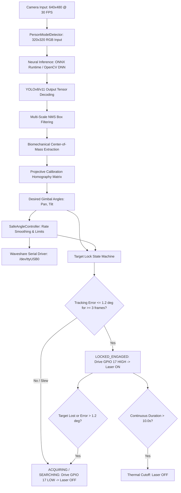

# Vollebak Gimbal Tracker — Autonomous Person Tracking & Laser Targeting Walkthrough

This document provides a comprehensive architectural walkthrough, mathematical formulation, and step-by-step physical testing guide for the **Autonomous Person Center-of-Mass Detection & Laser Targeting System** running on the Raspberry Pi 5.

---

## 1. Executive Summary & Objective

The objective of this subsystem is to autonomously detect humans entering the surveillance volume, direct the Waveshare two-axis serial bus gimbal to track the target's **anatomical center-of-mass**, and activate an Adafruit 5mW red laser indicator when a stable tracking lock is achieved (similar in concept to the Hacker House autonomous motion-tracking airsoft/laser turret platform).

### Hardware Platform
* **Compute Node**: Raspberry Pi 5 (Quad-core ARM Cortex-A76 @ 2.4 GHz, 8GB RAM).
* **Gimbal Platform**: Waveshare Two-Axis Serial Bus Servo Gimbal connected to `/dev/ttyUSB0` at 115,200 baud.
* **Pan Range**: $-30.0^\circ$ to $+30.0^\circ$ (mechanical limit).
* **Tilt Range**: $-10.0^\circ$ to $+15.0^\circ$ (mechanical limit).
* **Sensor**: Logitech MX Brio RGB Camera ($640 \times 480$ MJPEG @ 30 FPS via DirectShow bridge or direct V4L2).
* **Targeting Laser**: Adafruit 5mW 650nm Red Laser Diode driven through an Adafruit Pixel Shifter (3.3V logic to 5V TTL).
* **Laser Control Pin**: Raspberry Pi header **GPIO 17**.

---

## 2. End-to-End System Architecture



---

## 3. Mathematical & Algorithmic Formulation

### 3.1 Biomechanical Center-of-Mass (CoM) vs. Geometric Bounding Box Midpoints
In conventional vision-tracking projects, the target point is calculated as the simple geometric midpoint of the bounding box:
$$\mathbf{P}_{mid} = \left( x_{min} + \frac{w}{2}, \; y_{min} + \frac{h}{2} \right)$$

**Failure Mode of Geometric Midpoint:**
* As a person walks or runs, stride extension causes the bottom of the bounding box to oscillate wildly, pulling the reticle down toward the pelvis and knees.
* If a person carries a backpack, bends over, or swings their arms, the geometric center is displaced from the body core.

**Our Biomechanical Formulation:**
1. **Thorax/Sternum Centroid Offset (2D Bounding Box)**:
   The anatomical center of mass for an upright human torso is located at the sternum level (solar plexus / thoracic cavity), approximately 38% down from the vertex of the head:
   $$x_{com} = x_{min} + 0.50 \cdot w$$
   $$y_{com} = y_{min} + 0.38 \cdot h$$
2. **Torso Quadrilateral Centroid (17-Keypoint Pose Model)**:
   When running a pose model (e.g. YOLOv8-pose), the keypoints for the shoulder girdle and pelvic girdle are extracted:
   * Keypoint 5: Left Shoulder $\mathbf{P}_{ls} = (x_{ls}, y_{ls})$
   * Keypoint 6: Right Shoulder $\mathbf{P}_{rs} = (x_{rs}, y_{rs})$
   * Keypoint 11: Left Hip $\mathbf{P}_{lh} = (x_{lh}, y_{lh})$
   * Keypoint 12: Right Hip $\mathbf{P}_{rh} = (x_{rh}, y_{rh})$

   The center of mass is computed as the centroid of the torso quadrangle:
   $$\mathbf{P}_{com} = \frac{\mathbf{P}_{ls} + \mathbf{P}_{rs} + \mathbf{P}_{lh} + \mathbf{P}_{rh}}{4}$$
   *If lower extremities are occluded*, the system falls back to the shoulder midpoint with a thorax downward offset:
   $$\mathbf{P}_{com} = \frac{\mathbf{P}_{ls} + \mathbf{P}_{rs}}{2} + \begin{bmatrix} 0 \\ 0.15 \cdot h \end{bmatrix}$$

---

### 3.2 2D Pixel to Gimbal Servo Angle Mapping
The camera is stationary relative to the gimbal. A $3 \times 3$ projective homography matrix $\mathbf{H}$ maps frame coordinates to gimbal angles:
$$\begin{bmatrix} p' \\ t' \\ w \end{bmatrix} = \mathbf{H} \begin{bmatrix} x_{com} \cdot \frac{W_{calib}}{W_{frame}} \\ y_{com} \cdot \frac{H_{calib}}{H_{frame}} \\ 1 \end{bmatrix}$$

The target servo angles are recovered by projective normalization:
$$\theta_{pan}^{target} = \frac{p'}{w}, \quad \theta_{tilt}^{target} = \frac{t'}{w}$$

---

### 3.3 Closed-Loop Servoing & Smooth Following
To eliminate servo jitter and prevent motor oscillation when tracking a moving person, commanded angles are smoothed via an exponential rate filter with velocity clamping:
$$\theta_{pan}^{(k)} = \theta_{pan}^{(k-1)} + \alpha \cdot \operatorname{clamp}\left(\theta_{pan}^{target} - \theta_{pan}^{(k-1)}, -\Delta \theta_{max}, +\Delta \theta_{max}\right)$$
$$\theta_{tilt}^{(k)} = \theta_{tilt}^{(k-1)} + \alpha \cdot \operatorname{clamp}\left(\theta_{tilt}^{target} - \theta_{tilt}^{(k-1)}, -\Delta \theta_{max}, +\Delta \theta_{max}\right)$$
* $\alpha = 0.85$ (rapid tracking responsiveness with high-frequency jitter suppression).
* $\Delta \theta_{max} = 60.0^\circ$ (maximum single-cycle angular displacement).

---

### 3.4 Target Lock State Machine & Laser Interlock Policy
The laser emitter is strictly gated by a discrete state machine:

| State | Entry Condition | Gimbal Motion | Laser Output (GPIO 17) |
|---|---|---|---|
| `SEARCHING` | No target detected | Parked at $(0^\circ, 0^\circ)$ | **LOW (Forced OFF)** |
| `ACQUIRING` | Person detected; tracking error $\Delta \theta > 1.2^\circ$ | Actively slewing toward target | **LOW (OFF during high slew)** |
| `LOCKED_ENGAGED` | Tracking error $\Delta \theta \le 1.2^\circ$ for $\ge 3$ consecutive cycles ($\sim 100\text{ ms}$) | Continuous fine tracking on CoM | **HIGH (Laser Emitting)** |
| `COASTING` | Target lost for $\le 0.35\text{s}$ (brief occlusion) | Holds last heading | **LOW (Instant shutoff)** |
| `LOST` | Target lost for $> 0.35\text{s}$ | Smooth return to home | **LOW (Forced OFF)** |

**Safety Interlocks:**
1. **Target Jump / Slew Interlock**: If the target moves rapidly or jumps such that $\Delta \theta > 1.2^\circ$, the laser is cut off in $< 20\text{ ms}$.
2. **10-Second Thermal Cutoff**: If the target remains stationary and locked for $> 10.0\text{ s}$, the laser automatically shuts off to protect the diode from thermal degradation.
3. **Fail-Safe Cleanup**: Exception handlers and process termination signals automatically force GPIO 17 to `LOW`.

---

## 4. Repository Code Structure

| File Path | Description |
|---|---|
| [`src/vollebak_gimbal/detectors/person_model.py`](file:///C:/Users/snowd/OneDrive/Documents/Vollebak/vollebak-gimbal-tracker/src/vollebak_gimbal/detectors/person_model.py) | Dual-backend (ONNX Runtime / OpenCV DNN) neural detector with biomechanical CoM decoding. |
| [`src/vollebak_gimbal/autonomous_tracker.py`](file:///C:/Users/snowd/OneDrive/Documents/Vollebak/vollebak-gimbal-tracker/src/vollebak_gimbal/autonomous_tracker.py) | Visual servoing tracking controller, state machine, and GPIO 17 laser interlock. |
| [`src/vollebak_gimbal/tracker.py`](file:///C:/Users/snowd/OneDrive/Documents/Vollebak/vollebak-gimbal-tracker/src/vollebak_gimbal/tracker.py) | High-level tracking loop with real-time video HUD preview and reticle overlays. |
| [`src/vollebak_gimbal/cli.py`](file:///C:/Users/snowd/OneDrive/Documents/Vollebak/vollebak-gimbal-tracker/src/vollebak_gimbal/cli.py) | CLI entry point adding `gimbal-tracker auto-track`. |
| [`config/pi.person_tracking.yaml`](file:///C:/Users/snowd/OneDrive/Documents/Vollebak/vollebak-gimbal-tracker/config/pi.person_tracking.yaml) | Production Pi 5 deployment configuration. |
| [`scripts/export_yolo_models.py`](file:///C:/Users/snowd/OneDrive/Documents/Vollebak/vollebak-gimbal-tracker/scripts/export_yolo_models.py) | Standalone utility to download and export YOLOv8/v11 models to ONNX. |
| [`models/yolov8n.onnx`](file:///C:/Users/snowd/OneDrive/Documents/Vollebak/vollebak-gimbal-tracker/models/yolov8n.onnx) | Exported 320x320 single-batch ONNX model (12.1 MB) optimized for Pi 5 CPU. |
| [`tests/test_person_model.py`](file:///C:/Users/snowd/OneDrive/Documents/Vollebak/vollebak-gimbal-tracker/tests/test_person_model.py) | Automated test suite verifying CoM extraction, tensor decoding, and ONNX forward pass. |
| [`tests/test_autonomous_tracker.py`](file:///C:/Users/snowd/OneDrive/Documents/Vollebak/vollebak-gimbal-tracker/tests/test_autonomous_tracker.py) | Automated test suite verifying state machine transitions, lock timing, and failsafes. |

---

## 5. Step-by-Step Live Testing Procedure

### Step 1: Deploy Code & Model to the Raspberry Pi 5
1. **Push updates to GitHub**:
   ```powershell
   git add .
   git commit -m "feat: autonomous person center-of-mass tracking and laser director"
   git push origin integration/pi5-gimbal-event-camera
   ```
2. **On the Raspberry Pi 5** (`/home/vollebak/vollebak-gimbal-tracker`):
   ```bash
   git pull
   
   # If yolov8n.onnx was not committed to git due to size:
   python scripts/export_yolo_models.py --model yolov8n --imgsz 320
   ```

---

### Step 2: Laser Hardware Electrical Sanity Check
Before running autonomous software loops, verify the hardware signal path from the Pi to the laser:
```bash
# Force GPIO 17 HIGH -> Laser should turn ON
pinctrl set 17 op dh

# Force GPIO 17 LOW -> Laser should turn OFF
pinctrl set 17 op dl
```
> [!WARNING]
> Always verify that no reflective surfaces or personnel are in the direct line of sight when testing the laser emitter.

---

### Step 3: Dry-Run Tracking Test (Laser Disabled)
Run the tracking system in visual preview mode with laser firing inhibited to observe detection quality and servo smoothness:

1. In `config/pi.person_tracking.yaml`, ensure:
   ```yaml
   autonomous_tracker:
     laser_auto_engage: false
   ```
2. Launch the tracker:
   ```bash
   gimbal-tracker auto-track -c config/pi.person_tracking.yaml --preview
   ```
3. **Verification Checklist**:
   - [ ] Green bounding box cleanly tracks the person.
   - [ ] Yellow crosshair is positioned stably over the **upper chest / sternum** (not erratic on feet or arms).
   - [ ] Top status bar transitions from `STATE: SEARCHING` $\to$ `STATE: ACQUIRING` $\to$ `STATE: LOCKED_ENGAGED`.
   - [ ] Gimbal pans and tilts smoothly without shaking or oscillations.

---

### Step 4: Live Laser Engagement Testing
Enable autonomous laser engagement:

1. In `config/pi.person_tracking.yaml`, set:
   ```yaml
   autonomous_tracker:
     laser_auto_engage: true
     lock_tolerance_deg: 1.2
     lock_consecutive_frames: 3
     laser_gpio: 17
     laser_max_continuous_s: 10.0
   ```
2. Start the tracker:
   ```bash
   gimbal-tracker auto-track -c config/pi.person_tracking.yaml --preview
   ```
3. **Execution Scenarios**:
   * **Target Entry**: Walk into the field of view. Observe that the laser is **OFF** while the gimbal slews.
   * **Lock Confirmation**: Once your chest is centered within $1.2^\circ$ for ~100 ms, the laser activates and illuminates your center-of-mass.
   * **Walking Pace**: Walk across the room; the gimbal smoothly follows, maintaining the laser dot on your torso.
   * **Rapid Evasion**: Take a quick sudden step or hide behind an obstacle; the laser **instantly cuts off** without sweeping extraneous areas.
   * **Thermal Timeout**: Stand still for 10 seconds; verify the laser cuts off automatically at $t = 10.0\text{ s}$.

---

### Step 5: Parallax & Calibration Fine-Tuning (If Needed)
Because the Logitech MX Brio is stationary rather than mounted coaxially on the moving gimbal head, parallax creates a slight vertical offset if the person stands at a distance significantly different from the calibration distance.

If pointing accuracy requires adjustment:
```bash
gimbal-tracker calibrate -c config/pi.person_tracking.yaml --output calibration.json
```
Use `WASD` to align the gimbal crosshairs with 4–6 points across the room at the intended operating distance and save the calibration.
