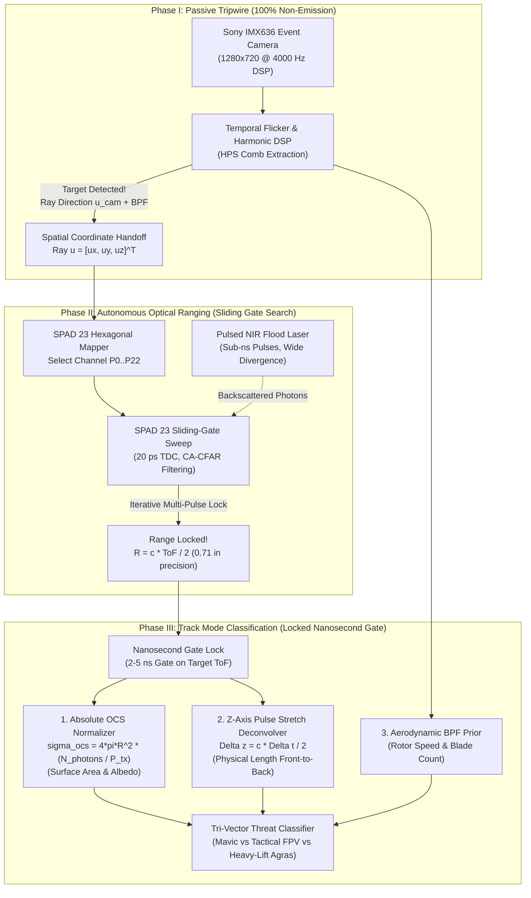
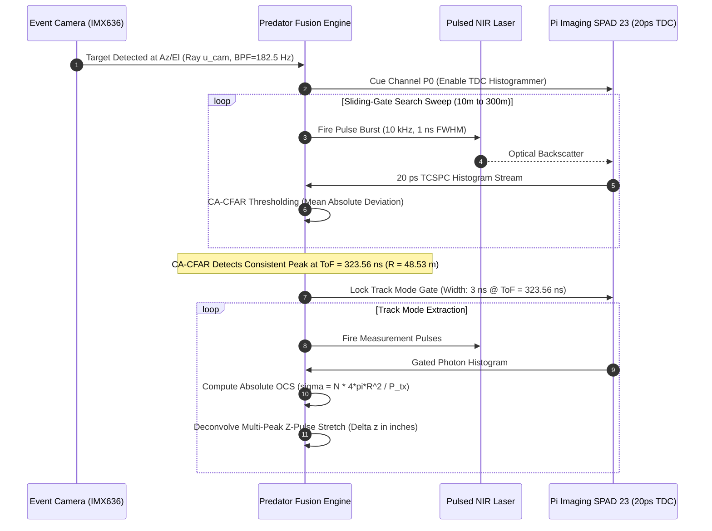

# Implementation Plan: Event Camera to SPAD 23 Stealth Optical Ranging & OCS Classification

## 1. Executive Summary & Tactical Concept of Operations (CONOPS)

### 1.1 The Non-Emission (EMCON) Imperative
Traditional air defense and Counter-UAS architectures rely heavily on active microwave RF radar emissions for target range and tracking. In contested electronic warfare (EW) environments, active RF emissions introduce critical vulnerabilities:
1. **RF Anti-Radiation Homing & Direction Finding (DF)**: Enemy electronic intelligence (ELINT) systems immediately triangulate active radar transmitters.
2. **RF Jamming / Spoofing**: Microwave radars are susceptible to high-power noise jamming, digital radio frequency memory (DRFM) spoofing, and ground multipath clutter.

**Project Predator's Optical Search-to-Track Architecture** operates in complete **Emission Control (EMCON)**:
- **Phase I (Passive Spatial Cueing)**: The Sony IMX636 event camera operates in **100% passive reception** (zero optical/RF emissions), detecting high-frequency propeller flicker ($f_{\text{BPF}}$) across a $1280 \times 720$ FOV with microsecond latency and $>120\,\text{dB}$ dynamic range.
- **Phase II (Covert LPI Active Optical Ranging)**: A flood-illuminating sub-nanosecond pulsed Near-Infrared (NIR) laser fires short, low-duty-cycle pulses (Low Probability of Intercept / LPI). The **Pi Imaging SPAD 23** autonomously sweeps its $20\,\text{ps}$ sliding gate to measure Time-of-Flight ($R$) via iterative CA-CFAR histogram filtering—**eliminating the need for any RF radar emissions**.
- **Phase III (High-Fidelity Classification)**: The SPAD 23 locks a narrow nanosecond gate on the target's ToF, extracting **Absolute Optical Cross Section ($\sigma_{\text{OCS}}$)** and **$Z$-Axis Pulse Stretching (physical depth in inches)**.



---

## 2. SPAD 23 Hexagonal Sensor Plane Geometry & Spatial Handoff

### 2.1 Sensor Architecture
The **Pi Imaging SPAD 23** consists of 23 micro-lens-enhanced hexagonal single-photon avalanche diodes arranged in a close-packed concentric pattern:
- **Central Diode ($P_0$)**: Optical center $(0, 0)$.
- **Ring 1 (6 Diodes, $P_1\text{--}P_6$)**: Radius $r_1 = d_{\text{pitch}}$, angle $\theta_k = k \cdot 60^\circ$.
- **Ring 2 (12 Diodes, $P_7\text{--}P_{18}$)**: Radius $r_2 = \sqrt{3}d_{\text{pitch}}$ and $2d_{\text{pitch}}$.
- **Outer Corners (4 Diodes, $P_{19}\text{--}P_{22}$)**: Edge perimeter coverage.

```
                             SPAD 23 Channel Map
                             
                                   [19]  [20]
                                [7]   [8]   [9]
                             [18]  [1]   [2]  [10]
                                [6]   [0]   [3]   [21]
                             [17]  [5]   [4]  [11]
                                [16]  [15]  [12]
                                   [22]
```

### 2.2 Mathematical Transformation Algorithm
When the Event Camera's `SpatialFlickerClusterer` locks onto a drone at pixel coordinate $(x_{\text{ev}}, y_{\text{ev}})$:

1. **Ray Unit Vector Generation**:
   $$\mathbf{d}_{\text{ev}} = \mathbf{K}_{\text{ev}}^{-1} \begin{bmatrix} x_{\text{ev}} \\ y_{\text{ev}} \\ 1 \end{bmatrix} = \begin{bmatrix} (x_{\text{ev}} - 640) / 1646.09 \\ (y_{\text{ev}} - 360) / 1646.09 \\ 1 \end{bmatrix}, \quad \hat{\mathbf{u}}_{\text{ev}} = \frac{\mathbf{d}_{\text{ev}}}{\|\mathbf{d}_{\text{ev}}\|}$$

2. **Extrinsic Alignment to SPAD Optical Axis**:
   $$\hat{\mathbf{u}}_{\text{spad}} = \mathbf{R}_{\text{spad} \leftarrow \text{ev}} \hat{\mathbf{u}}_{\text{ev}} = \begin{bmatrix} u_x' \\ u_y' \\ u_z' \end{bmatrix}$$

3. **Continuous Focal Plane Mapping**:
   $$x_{\text{spad\_focal}} = f_{\text{spad}} \cdot \frac{u_x'}{u_z'}, \quad y_{\text{spad\_focal}} = f_{\text{spad}} \cdot \frac{u_y'}{u_z'}$$

4. **Hexagonal Nearest-Neighbor Channel Solver**:
   $$\text{Channel ID} = \arg\min_{i \in [0..22]} \left\| \begin{bmatrix} x_{\text{spad\_focal}} \\ y_{\text{spad\_focal}} \end{bmatrix} - \mathbf{C}_i \right\|$$
   where $\mathbf{C}_i$ is the physical metric center coordinate of hexagonal SPAD diode $i$.

---

## 3. Autonomous Optical Ranging Pipeline (Sliding-Gate Search Mode)

Without any external RF radar feed, the optical system acts as its own autonomous rangefinder using the SPAD 23's internal Time-to-Digital Converters (TDCs):



### 3.1 Temporal Sweep Envelope
- **Range Domain**: $R_{\text{min}} = 10\,\text{m}$ to $R_{\text{max}} = 300\,\text{m}$.
- **Time-of-Flight Domain**:
  $$t_{\text{ToF}} = \frac{2R}{c} \implies t \in [66.71\,\text{ns}, \quad 2001.38\,\text{ns}]$$
- **Total Discrete $20\,\text{ps}$ Bins**:
  $$N_{\text{bins}} = \frac{2001.38\,\text{ns} - 66.71\,\text{ns}}{0.020\,\text{ns}} = 96,734\,\text{bins}$$

### 3.2 Iterative CA-CFAR Multi-Pulse Confidence Gate
To reject atmospheric aerosols and single-photon solar noise:
1. **Sliding Coarse Windows**: The SPAD aggregates $50\,\text{ns}$ temporal chunks across 10 laser pulses.
2. **Cell-Averaging Constant False Alarm Rate (CA-CFAR)**:
   $$V_{\text{threshold}}(t) = \mu_{\text{noise}}(t \pm \delta) + \alpha \cdot \text{MAD}(t \pm \delta)$$
3. **Multi-Frame Temporal Coherence**: A valid target return must register in the same temporal bin ($\pm 2\,\text{bins}$) across $M=3$ consecutive pulse bursts.

---

## 4. Absolute OCS Normalization & $Z$-Axis Pulse Stretching

### 4.1 Range-Normalized Absolute Optical Cross Section ($\sigma_{\text{OCS}}$)
When the verified Time-of-Flight yields range $R$, the photon counts collected in the locked nanosecond gate are normalized against the inverse-square geometric attenuation:

$$\sigma_{\text{OCS}} = \frac{4\pi R^2 \cdot N_{\text{photons}}}{P_{\text{tx}} \cdot \eta_{\text{opt}} \cdot \eta_{\text{SPAD}} \cdot T_{\text{atm}}^2(R)}$$

| Target Class | Representative Model | Expected $\sigma_{\text{OCS}}$ at 1064nm / 808nm | Physical Distinction |
| :--- | :--- | :--- | :--- |
| **Micro / Sub-250g** | DJI Mini 3 / 4 | $0.001\text{--}0.005\,\text{m}^2$ | Minimal chassis area, tiny motors. |
| **Small Commercial** | DJI Mavic 2 / 3 | $0.008\text{--}0.025\,\text{m}^2$ | Compact arms, plastic/matte finish. |
| **Medium Tactical / FPV** | 7-inch / 10-inch FPV Quad | $0.030\text{--}0.080\,\text{m}^2$ | Exposed carbon plate, large battery pack. |
| **Heavy-Lift / Agras** | DJI Agras T30 / T40 / Octocopter | $\mathbf{0.400\text{--}1.500\,\text{m}^2}$ | **$20\text{--}100\times$ higher photon backscatter!** |

### 4.2 $Z$-Axis Pulse Stretching Mathematics ($20\,\text{ps}$ TDC)
When a short laser pulse ($1\,\text{ns}$ FWHM) strikes an oblique drone, spatial depth broadens the returning waveform:

$$\Delta z_{\text{wheelbase}} = \frac{c \cdot \Delta t_{\text{multi-peak}}}{2 \cdot \cos\theta_{\text{aspect}}}$$

With the SPAD 23's **$120\,\text{ps}$ FWHM jitter**, depth resolution is **$18\,\text{mm} = 0.71\,\text{inches}$**.

```
  SPAD 23 Photon Histogram H(t) [20 ps bins]
  
  Counts
    ▲
    │         ┌─┐ Front Rotor Peak (t_front)
    │        ┌┘ └┐           ┌─┐ Fuselage Center (t_body)
    │        │   │          ┌┘ └┐             ┌─┐ Rear Rotor Peak (t_rear)
    │      ──┘   └──────────┘   └─────────────┘ └───
    └────────────────────────────────────────────────► Time (ps)
             ◄────────────── Δt_span ──────────────►
             
             Physical Depth: Δz = (c * Δt_span) / 2
             - DJI Mavic:      Δt = 2.0 ns  (100 bins) --> Δz = 11.8 inches
             - Tactical FPV:   Δt = 3.5 ns  (175 bins) --> Δz = 20.7 inches
             - Heavy Agras:    Δt = 10.0 ns (500 bins) --> Δz = 59.1 inches
```

---

## 5. Software Architecture & Implementation Roadmap

### 5.1 Proposed C++ Classes to Add to `ev_ingestion_cpp/`

```
ev_ingestion_cpp/
├── spad23_mapper.hpp            <-- Hexagonal 23-channel coordinate solver
├── spad_tcspc_simulator.hpp     <-- 20ps TDC photon histogram generator (for pre-hardware testing)
├── spad_cfar_ranging.hpp        <-- Sliding-gate autonomous rangefinder engine
├── ocs_classifier.hpp           <-- Tri-Vector (OCS + Pulse Stretch + BPF) threat classifier
```

#### Class 1: `Spad23HexagonalMapper` (`spad23_mapper.hpp`)
- Precomputes the metric Centers $\mathbf{C}_0\text{--}\mathbf{C}_{22}$ for the 23 diodes based on the Pi Imaging SPAD 23 optical geometry.
- Provides `int map_ray_to_channel(double ux, double uy, double uz, double& subpixel_dx, double& subpixel_dy)`.

#### Class 2: `SpadAutonomousRanger` (`spad_cfar_ranging.hpp`)
- Implements the sliding temporal gate search ($10\text{m}\text{--}300\text{m}$).
- Executes CA-CFAR thresholding on aggregated $20\,\text{ps}$ histograms.
- Emits confirmed range $R \pm 0.05\,\text{m}$ with statistical confidence score.

#### Class 3: `OpticalCrossSectionProfiler` (`ocs_classifier.hpp`)
- Normalizes total gated photon counts against $R^2$.
- Performs Modified Biexponential / Multi-Gaussian peak fitting to extract $\Delta t_{\text{span}}$.
- Converts $\Delta t_{\text{span}} \to \Delta z_{\text{inches}}$.
- Fuses $[f_{\text{BPF}}, \sigma_{\text{OCS}}, \Delta z_{\text{inches}}]$ into a unified classification payload.

---

## 6. Phased Execution Roadmap

- [ ] **Phase 12: SPAD 23 Hexagonal Geometry & Coordinate Solver**
  - Implement `Spad23HexagonalMapper` in C++.
  - Build automated unit tests verifying angular ray mapping from $1280 \times 720$ event plane to SPAD Channels $0\text{--}22$.
- [ ] **Phase 13: Autonomous Sliding-Gate CA-CFAR Ranging Engine**
  - Implement TCSPC histogram accumulator with $20\,\text{ps}$ binning.
  - Implement Cell-Averaging CFAR and multi-pulse temporal coherence validator.
  - Test simulated ranging across $10\text{m}\text{--}300\text{m}$ under solar noise backgrounds.
- [ ] **Phase 14: Absolute OCS & $Z$-Axis Pulse Stretch Deconvolver**
  - Implement $R^2$ OCS normalizer.
  - Implement multi-peak pulse broadening depth extractor ($18\,\text{mm} / 0.71\,\text{in}$ resolution).
  - Verify threat classification for Mavic vs FPV vs Agras profiles.
- [ ] **Phase 15: Hardware Driver Integration (On Hardware Arrival)**
  - Integrate Pi Imaging SPAD 23 USB3 / TCP/IP C++ SDK into live Orin Nano pipeline.
  - Connect SMA trigger lines to pulsed NIR laser driver.
