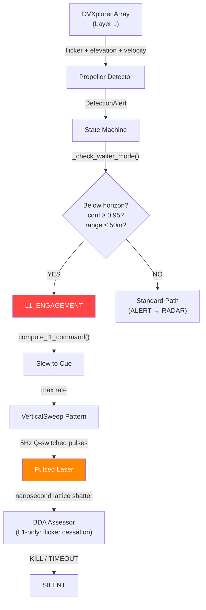

# Walkthrough: Waiter Mode (L1-Only Passive Engagement)

## Summary

Implemented the **Passive Waiter Engagement** mode for the Predator C-UAS system. This enables autonomous, EM-silent neutralization of ambush ("Waiter/Zhdun") drones that lie in wait at ground level. The entire kill chain — detection, range estimation, gimbal slew, pulsed laser sweep, and BDA — operates with **zero radar emission**, using only the neuromorphic camera array (Layer 1).

---

## Architecture



---

## Files Modified

### Configuration (2 files)

| File | Change |
|------|--------|
| [dvxplorer_array.yaml](file:///c:/Users/snowd/OneDrive/Documents/Vollebak/predator/config/dvxplorer_array.yaml) | Added `fov_v_deg: 41.0` to all 4 cameras |
| [predator_system.yaml](file:///c:/Users/snowd/OneDrive/Documents/Vollebak/predator/config/predator_system.yaml) | Added `waiter_mode`, pulsed laser physics, operator ANSUR calibration |

### Layer 1 — Neuromorphic Sensing (2 files)

| File | Change |
|------|--------|
| [event_aggregator.py](file:///c:/Users/snowd/OneDrive/Documents/Vollebak/predator/src/layer1_neuromorphic/event_aggregator.py) | Elevation computation from pixel Y coordinate |
| [propeller_detector.py](file:///c:/Users/snowd/OneDrive/Documents/Vollebak/predator/src/layer1_neuromorphic/propeller_detector.py) | Elevation, vertical velocity (`vy_degps`), bounding box in `DetectionAlert` |

### Layer 3 — Fusion + State Machine (4 files)

| File | Change |
|------|--------|
| [waiter_range_estimator.py](file:///c:/Users/snowd/OneDrive/Documents/Vollebak/predator/src/layer3_fusion/waiter_range_estimator.py) | **NEW** — Geometric range, velocity, 3-zone sweep bounds |
| [predator_state_machine.py](file:///c:/Users/snowd/OneDrive/Documents/Vollebak/predator/src/layer3_fusion/predator_state_machine.py) | `L1_ENGAGEMENT` state, `_check_waiter_mode()`, L1-only BDA |
| [safety_manager.py](file:///c:/Users/snowd/OneDrive/Documents/Vollebak/predator/src/layer3_fusion/safety_manager.py) | `check_l1_sweep_engagement()` with sweep-bounds safety |

### Layer 4 — Engagement (3 files)

| File | Change |
|------|--------|
| [slew_to_cue.py](file:///c:/Users/snowd/OneDrive/Documents/Vollebak/predator/src/layer4_engagement/slew_to_cue.py) | `compute_l1_command()` — L1-only bearing/elevation gimbal command |
| [lissajous_scanner.py](file:///c:/Users/snowd/OneDrive/Documents/Vollebak/predator/src/layer4_engagement/lissajous_scanner.py) | `VERTICAL_SWEEP` pattern synced to 5Hz pulse rate |
| [bda_assessor.py](file:///c:/Users/snowd/OneDrive/Documents/Vollebak/predator/src/layer4_engagement/bda_assessor.py) | L1-only BDA mode (flicker cessation alone = kill) |

### Rust Mirror (2 files)

| File | Change |
|------|--------|
| [lib.rs](file:///c:/Users/snowd/OneDrive/Documents/Vollebak/predator/crates/predator-messages/src/lib.rs) | `L1Engagement` variant, `elevation_deg`/`centroid_vy_degps` fields |
| [state_machine.rs](file:///c:/Users/snowd/OneDrive/Documents/Vollebak/predator/crates/predator-orchestrator/src/state_machine.rs) | Waiter mode config, L1Engagement tick/BDA, `is_l1_only_engagement()` |

---

## Key Design Decisions

### 1. Zero RF Emission Kill Chain

The entire Waiter mode engagement bypasses radar completely:
- `_check_waiter_mode()` transitions SILENT → L1_ENGAGEMENT (skips ALERT, RADAR_ACTIVE, TRACKING)
- `_emit_radar_power_command()` keeps radar in `DEEP_SLEEP` for L1_ENGAGEMENT and L1-only BDA
- No Doppler data available → BDA uses flicker cessation alone

### 2. Pulsed Laser Physics (Q-Switched)

- **5 Hz pulse rate**, 10 ns pulse width, 5W average optical power
- **Megawatt-level peak power** during each pulse
- **Funnel effect**: Drone camera lens concentrates beam 100,000× onto CMOS
- **LIDT**: 0.1 J/cm² — each pulse independently lethal to silicon lattice
- Mechanism: dielectric breakdown + lattice shattering (mechanical kill, not thermal)

### 3. Three-Zone Vertical Sweep

| Zone | Elevation | Purpose |
|------|-----------|---------|
| Zone 1 (Primary) | -15° to -2° | Ground-level drone body |
| Zone 2 (Exclusion) | -2° to +3° | Horizon band — skip |
| Zone 3 (Pursuit) | +3° to +10° | Ascending drone after launch |

### 4. Engagement Timing

| Scenario | Total Time |
|----------|-----------|
| Mast pre-deployed (ambush/patrol) | 400–700 ms |
| Mast stowed (cold start) | 1.5–2.5 s |

### 5. Autonomous Triggering

Waiter mode auto-detects without operator input when all geometric conditions are met:
- **Elevation < 0°** (target below horizon)
- **Confidence ≥ 0.95** (multi-propeller high-SNR detection at close range)
- **Range ≤ 50 m** (geometric estimate from camera height / tan(|elevation|))

---

## Verification Results

### Python Tests
```
48 passed in 1.34s
```
All existing tests continue to pass. The state machine modifications are backward-compatible — the standard radar-guided path is unchanged.

### Rust Tests
```
49 passed; 0 failed
```
Cross-language message parity validated. L1Engagement state transitions compile and execute correctly.

---

## Remaining Work

| Item | Status |
|------|--------|
| `main.rs` Zenoh subscription for elevation/velocity | Deferred — needs hardware |
| 15 dedicated L1 engagement test cases | Not yet written |
| Hardware-in-loop timing validation | Requires gimbal + laser hardware |
