# Waiter Mode Kill Chain — Latency Analysis & Optimization

## Objective

Trace the complete data pipeline from **photon arrival at DVXplorer sensor** to **laser pulse on target** for the L1-only Waiter mode engagement. Identify every latency contributor, quantify it, and propose optimizations to meet the 400ms pre-deployed target.

---

## Current Pipeline Architecture

```mermaid
graph LR
    A["DVXplorer<br>USB Stream"] -->|"10ms batch"| B["EventAggregator<br>(Python)"]
    B -->|"bearing + elev"| C["PropellerDetector<br>(Python GPU)"]
    C -->|"DetectionAlert"| D["Zenoh Publish<br>(Python → msgpack)"]
    D -->|"IPC"| E["Rust Orchestrator<br>(Zenoh subscribe)"]
    E -->|"SM tick @ 200Hz"| F["State Machine<br>transition"]
    F -->|"SmCommand"| G["Zenoh Publish<br>(Rust → gimbal)"]
    G -->|"IPC"| H["Gimbal PID<br>(200Hz Rust)"]
    H -->|"servo"| I["Laser Fire"]
```



---

## Stage-by-Stage Latency Breakdown

### Stage 1: DVXplorer USB → Python EventBatch

| Parameter | Current Value | Notes |
|-----------|--------------|-------|
| Batch duration | **10,000 µs (10 ms)** | [dvxplorer_array.yaml L24](file:///c:/Users/snowd/OneDrive/Documents/Vollebak/predator/config/dvxplorer_array.yaml#L24) |
| USB 3.1 transfer | ~1 ms | Hardware-limited |
| Queue depth | 64 batches | [dvx_event_streamer.py L301](file:///c:/Users/snowd/OneDrive/Documents/Vollebak/predator/src/layer1_neuromorphic/dvx_event_streamer.py#L301) |

> [!CAUTION]
> **BOTTLENECK #1**: The 10ms batch duration is the single largest contributor to first-detection latency. A propeller that starts spinning at t=0 won't appear in a `DetectionAlert` until the batch window closes at t=10ms. Worst case: 10ms pure wait time before any processing begins.

**Contribution: 5–10 ms** (average 5ms, worst case 10ms)

---

### Stage 2: EventAggregator → Bearing/Elevation Enrichment

| Operation | Est. Latency |
|-----------|-------------|
| `compute_pixel_bearings()` — vectorized numpy | < 0.1 ms |
| `compute_pixel_elevations()` — vectorized numpy | < 0.1 ms |
| `_circular_mean_deg()` — numpy trig | < 0.1 ms |

**Contribution: < 0.5 ms** — Not a bottleneck. Pure numpy vectorized ops on ~1K events.

---

### Stage 3: PropellerDetector — SpMiniUNet Inference

| Parameter | Value | Notes |
|-----------|-------|-------|
| Voxelization (`time_bin_us=100`) | ~0.5 ms | numpy → SparseConvTensor |
| SpMiniUNet inference (GPU) | **2–5 ms** | Orin NX GPU, depends on event density |
| Dense → numpy + centroid | ~0.3 ms | `prediction.dense().squeeze().cpu()` |
| Tracker FSM update | < 0.1 ms | |

> [!WARNING]
> **BOTTLENECK #2**: The voxelization step creates a 3D sparse tensor with `batch_duration_us / time_bin_us = 50` time bins. For Waiter mode, the full 3D voxelization is overkill — the drone is stationary or near-stationary at close range. A simpler 2D event accumulation frame would be sufficient and faster.

**Contribution: 3–6 ms**

---

### Stage 4: Python → Zenoh → Rust IPC

| Operation | Est. Latency |
|-----------|-------------|
| Python `DetectionAlert` → msgpack serialize | ~0.1 ms |
| Zenoh publish (Python pyo3-zenoh) | ~0.5 ms |
| Zenoh IPC delivery | ~0.1 ms (shared memory) / **1–3 ms (network)** |
| Rust `from_msgpack` deserialize | < 0.1 ms |
| Tokio async wakeup | ~0.1 ms |

> [!IMPORTANT]
> **BOTTLENECK #3**: The current pipeline uses standard Zenoh network transport (`zenoh::Config::default()` at [main.rs L106](file:///c:/Users/snowd/OneDrive/Documents/Vollebak/predator/crates/predator-orchestrator/src/main.rs#L106)). Since Python and Rust run on the same Orin NX board, **Zenoh shared-memory transport** should be enabled. This eliminates the TCP/UDP kernel copy path and reduces IPC from ~1-3ms to ~0.1ms.

**Contribution: 0.5–3 ms** (current), **0.1–0.3 ms** (with SHM)

---

### Stage 5: Rust State Machine — Transition Logic

| Operation | Est. Latency |
|-----------|-------------|
| `on_layer1_detection()` match + transition | < 0.01 ms |
| `tick()` at 200Hz → drain_commands | < 0.01 ms |
| Tick period worst-case wait | **5 ms** (1/200Hz) |

> [!CAUTION]
> **BOTTLENECK #4**: The state machine `tick()` runs at 200Hz (5ms period). After `on_layer1_detection()` fires and enqueues commands, they sit in the `pending_commands` buffer until the **next tick cycle** drains them. Worst case: 5ms of pure wait.
>
> For Waiter mode, the L1 detection handler should **immediately drain and publish** commands rather than waiting for the next tick. The current architecture (tick at [main.rs L316](file:///c:/Users/snowd/OneDrive/Documents/Vollebak/predator/crates/predator-orchestrator/src/main.rs#L316)) processes subscribers and tick on separate async tasks — the subscriber handler can publish immediately after the SM emits commands.

**Contribution: 0–5 ms** (average 2.5ms)

---

### Stage 6: Rust → Zenoh → Gimbal PID

| Operation | Est. Latency |
|-----------|-------------|
| `to_msgpack` (GimbalCommand) | < 0.1 ms |
| Zenoh publish | ~0.1 ms (SHM) |
| Gimbal PID wakeup + 1 cycle | **5 ms** (200Hz) |

**Contribution: 0.1–5 ms** (average 2.5ms)

---

### Stage 7: Gimbal Slew + Laser Fire

| Operation | Est. Latency |
|-----------|-------------|
| Gimbal slew to target bearing | **50–200 ms** | Depends on angular distance |
| Safety interlock check | < 0.01 ms |
| Laser enable + first pulse | ~1 ms |

**Contribution: 50–200 ms** — Dominates the kill chain. Not software-optimizable.

---

## Total Kill Chain Timing (Current)

```
                         CURRENT (Pre-deployed mast)
  ┌──────────┬────────────┬──────────┬──────────┬──────────┬──────────┬──────────────┐
  │ DVX Batch│ Aggregator │ SpMiniU  │  Zenoh   │  SM Tick │  Zenoh   │ Gimbal Slew  │
  │  10 ms   │   0.5 ms   │  5 ms    │  2 ms    │  2.5 ms  │  2.5 ms  │  100 ms      │
  └──────────┴────────────┴──────────┴──────────┴──────────┴──────────┴──────────────┘
  Total: ~122 ms average, ~225 ms worst case (pre-deployed)
  Add mast deploy: +800–1200 ms (stowed scenario)
```

> [!NOTE]
> The current pipeline total of ~122ms average pre-deployed is already under 400ms. But the worst case (10ms batch + 5ms inference + 3ms IPC + 5ms tick + 5ms gimbal tick + 200ms slew) = **228ms**, which is still under budget. The issue is when the mast is stowed: **1.0–1.4s** total.

---

## Identified Optimizations

### Optimization 1: Reduce DVX Batch Duration (10ms → 2ms)

**Impact: Saves 4–8 ms per detection**

The current 10ms batch is inherited from the overlab-kevin training pipeline where throughput matters more than latency. For real-time engagement, 2ms batches are sufficient — the DVXplorer Micro at 640×480 still generates meaningful event counts in 2ms for a spinning propeller at close range.

**Changes required:**
- `dvxplorer_array.yaml`: `event_batch_us: 2000` and `batch_us: 2000`
- `PropellerDetector.__init__`: `batch_duration_us: 2000`
- `EventVoxelizer.__init__`: `batch_duration_us: 2000`, reduces time bins from 50 to 20

> [!WARNING]
> Must verify SpMiniUNet inference quality with 2ms batches. The model was trained on 10ms windows. If detection quality degrades, consider a configurable **dual-mode** approach: 10ms for standard operations, 2ms when in SILENT/pre-engagement with `waiter_mode_enabled=true`.

---

### Optimization 2: Zenoh Shared Memory Transport

**Impact: Saves 1–3 ms per IPC hop (×2 hops = 2–6 ms total)**

All Python↔Rust communication currently goes through standard Zenoh TCP/UDP transport. Since both processes co-reside on the Orin NX:

```rust
// main.rs — replace Config::default() with:
let mut config = zenoh::Config::default();
config.transport.shared_memory.set_enabled(Some(true));
let session = zenoh::open(config).await?;
```

Python side:
```python
import zenoh
conf = zenoh.Config()
conf.insert_json5("transport/shared_memory/enabled", "true")
session = zenoh.open(conf)
```

---

### Optimization 3: Waiter Mode Fast-Path (Bypass Full Voxelization)

**Impact: Saves 2–4 ms inference time**

For Waiter mode detections at < 50m, the full SpMiniUNet inference pipeline is more powerful than needed. The close-proximity, below-horizon, high-event-rate signature of a spinning propeller can be detected with a simpler **2D event-count frame** threshold:

```
close_range + below_horizon + high_event_rate → skip full voxel → direct DetectionAlert
```

This creates a parallel fast path that bypasses `EventVoxelizer.voxelize()` + `model(sparse_input)` entirely when the event spatial pattern already exceeds the confidence threshold. The full pipeline continues running for standard (distant) threats.

**Implementation sketch:**
```python
# propeller_detector.py — add fast path before full inference
def process_batch_fast(self, events, camera_id, timestamp_us):
    """Fast-path for Waiter mode — 2D frame threshold only."""
    tracker = self._trackers.get(camera_id)
    if tracker is None or tracker.state != TrackerState.TRACK:
        return None  # Fast path only for already-tracking targets
    
    # 2D event accumulation frame (no voxelization)
    frame = np.zeros((480, 640), dtype=np.float32)
    np.add.at(frame, (events[:, 1], events[:, 0]), 1.0)
    
    # Apply ROI mask from tracker
    frame = tracker._apply_roi_mask(frame)
    
    # Simple threshold — high event density at close range
    if np.max(frame) > self.waiter_fast_thresh:
        # Generate DetectionAlert without full inference
        ...
```

> [!IMPORTANT]
> This fast-path should **only activate** when the tracker is already in TRACK state (has a prior SpMiniUNet confirmation). It is a sustain/update path, not a first-detection path. First detection always uses full inference for confidence.

---

### Optimization 4: Immediate Command Drain on L1 Detection

**Impact: Saves 0–5 ms (average 2.5 ms)**

Currently the Rust orchestrator has the subscriber and tick loop as separate async tasks. The subscriber handler acquires the SM lock, calls `on_layer1_detection()`, drops the lock — then commands sit until the tick loop acquires the lock and calls `drain_commands()`.

For Waiter mode, the subscriber handler should drain and publish immediately:

```rust
// main.rs L1 subscriber — after on_layer1_detection:
if let Some(det) = det {
    let mut sm = sm_l1.lock().await;
    sm.on_layer1_detection(
        det.camera_id,
        det.bearing_deg,
        det.confidence,
        det.timestamp_us,
    );
    
    // WAITER MODE: immediate drain for time-critical L1 engagements
    if sm.is_l1_only_engagement() || sm.state() == SystemState::L1Engagement {
        let commands = sm.drain_commands();
        drop(sm); // Release lock before async publish
        for cmd in commands {
            publish_command(&cmd, &publishers, use_binary).await;
        }
    }
}
```

This eliminates the tick-wait latency entirely for the L1 engagement path.

---

### Optimization 5: Parallel Mast Deploy + Gimbal Pre-Aim

**Impact: Saves 200–500 ms on stowed-start engagement**

For stowed mast scenarios, the current pipeline is serial:
1. L1 detection → deploy mast (800–1200ms)
2. Mast deployed → slew gimbal to target
3. Gimbal on target → laser fire

The gimbal can begin pre-aiming during mast deployment using the Fast Steer Mirror:
1. L1 detection → deploy mast **AND** FSM pre-aim simultaneously
2. Mast deployed → gimbal already near target → fine slew only
3. Fine slew (< 50ms) → laser fire

This is **already partially implemented** via `PreSlewCommand`, but the gimbal controller needs to accept pre-slew commands while the mast is still deploying (currently gated by `arm_deployed`).

---

## Revised Timing Waterfall (Post-Optimization)

### Pre-Deployed Mast (Ambush/Patrol Mode)

```
  ┌──────────┬────────────┬──────────┬──────────┬──────────┬──────────┬──────────────┐
  │ DVX Batch│ Aggregator │ Fast Det │  Zenoh   │  SM+Pub  │  Zenoh   │ Gimbal Slew  │
  │   2 ms   │   0.3 ms   │  1 ms    │  0.2 ms  │  0.1 ms  │  0.2 ms  │  100 ms      │
  └──────────┴────────────┴──────────┴──────────┴──────────┴──────────┴──────────────┘
  Average: ~104 ms
  Worst case (full inference + max slew): ~213 ms
```

### Stowed Mast (Cold Start)

```
  ┌──────────┬────────────┬──────────┬──────────┬──────────────────────┬──────────┐
  │ DVX Batch│ Detection  │  Zenoh   │  SM+Pub  │ Mast Deploy          │Fine Slew │
  │   2 ms   │   4 ms     │  0.2 ms  │  0.1 ms  │ 800 ms (parallel aim)│  50 ms   │
  └──────────┴────────────┴──────────┴──────────┴──────────────────────┴──────────┘
  Average: ~856 ms
  Worst case (slow deploy + cold GPU): ~1300 ms
```

---

## Summary of Optimizations

| # | Optimization | Latency Saved | Risk | Complexity |
|---|-------------|--------------|------|-----------|
| 1 | Batch 10ms → 2ms | 4–8 ms | Model quality check needed | Low |
| 2 | Zenoh SHM transport | 2–6 ms | Config-only change | **Very Low** |
| 3 | Waiter fast-path detection | 2–4 ms | Only for sustained tracking | Medium |
| 4 | Immediate command drain | 0–5 ms | Lock contention edge case | Low |
| 5 | Parallel deploy + pre-aim | 200–500 ms | Gimbal controller change | Medium |

> [!IMPORTANT]
> **Optimization 2 (Zenoh SHM) should be implemented immediately** — it's a config-only change with zero risk and saves 2–6ms across two IPC hops. It requires no code changes to the message format or pipeline logic.

---

## Rust State Machine Gap: Elevation/Velocity Passthrough

The Rust `on_layer1_detection()` currently takes `(camera_id, bearing_deg, confidence, timestamp_us)` but **does not accept elevation or velocity** — the fields are on the message struct but hardcoded to `None` in the handler ([state_machine.rs L357-358](file:///c:/Users/snowd/OneDrive/Documents/Vollebak/predator/crates/predator-orchestrator/src/state_machine.rs#L357-L358)).

For the Waiter mode fast-path to work in Rust, the handler signature must be extended:

```rust
pub fn on_layer1_detection(
    &mut self,
    camera_id: u8,
    bearing_deg: f64,
    confidence: f64,
    timestamp_us: u64,
    elevation_deg: Option<f64>,     // NEW
    centroid_vy_degps: Option<f64>,  // NEW
) {
    // ... existing logic ...
    
    // Waiter mode auto-detect (mirrors Python _check_waiter_mode)
    if self.config.waiter_mode_enabled {
        if let Some(el) = elevation_deg {
            if el < 0.0 && confidence >= self.config.l1_engagement_confidence {
                let range_est = self.config.operator_camera_height_m 
                    / el.abs().to_radians().tan();
                if range_est <= self.config.l1_max_range_m {
                    self.l1_only_bda = false;
                    self.transition_to(
                        SystemState::L1Engagement,
                        "waiter_mode_auto_detect"
                    );
                    // Emit immediate GimbalCue
                    return;
                }
            }
        }
    }
}
```

And `main.rs` must pass the fields through:

```rust
sm.on_layer1_detection(
    det.camera_id,
    det.bearing_deg,
    det.confidence,
    det.timestamp_us,
    det.elevation_deg,       // NEW
    det.centroid_vy_degps,   // NEW
);
```

---

## Conclusion

The current pipeline is **already viable** for pre-deployed mast scenarios (~122ms average). The primary risk is the **10ms batch duration** and **Zenoh network transport** adding unnecessary padding. With the five proposed optimizations applied, the pipeline achieves:

- **Pre-deployed: ~104 ms average** (well under 400ms target)
- **Stowed: ~856 ms average** (within the 1.5–2.5s budget)
- **Worst case pre-deployed: ~213 ms** (52% margin to 400ms target)
