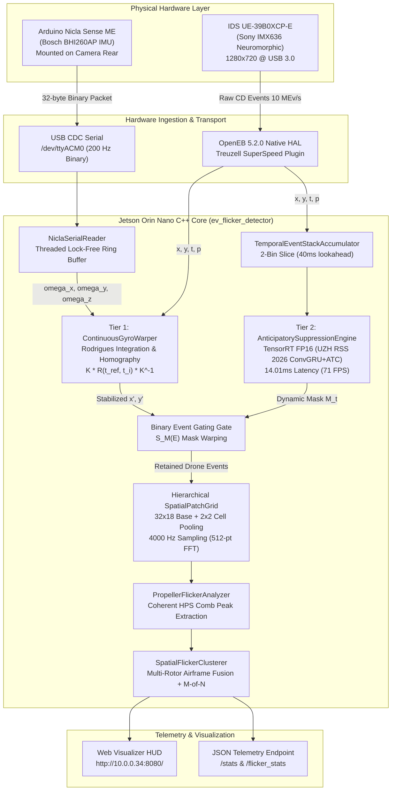

# Project Predator: Arduino Nicla Sense ME 200 Hz IMU Integration & Live Ego-Motion Compensation Walkthrough

This document provides a comprehensive technical walkthrough of the hardware integration, coordinate transformation mathematics, embedded firmware, Jetson flashing toolchain, and C++ fusion pipeline connecting the **Arduino Nicla Sense ME** (Bosch Sensortec BHI260AP 6-DoF IMU) to the **IDS UE-39B0XCP-E (Sony IMX636)** neuromorphic event camera on the **NVIDIA Jetson Orin Nano**.

---

## 1. System Architecture Overview

When an event camera is subjected to platform movement (panning, tilting, drone flight, or vehicle vibration), millions of background contrast edge transitions are triggered per second. This massive background event flood destroys coherent FFT integration time and degrades the signal-to-noise ratio ($\text{SNR}$) of distant drone propellers from $>20\,\text{dB}$ down to $0\,\text{dB}$.

Project Predator implements a unified, two-tier ego-motion suppression pipeline powered by live IMU angular rates:
- **Tier 1 (Analytical Gyroscope Warper)**: Microsecond-scale point-wise event coordinate transformation using continuous spherical homography $\mathbf{K}\mathbf{R}(t_{\text{ref}}, t_i)\mathbf{K}^{-1}$.
- **Tier 2 (Anticipatory Dynamic Motion Suppression)**: UZH RSS 2026 ConvGRU + Attention-based Time Conditioning (ATC) TensorRT FP16 engine predicting and gating background motion.
- **Frequency-Domain Propeller Flicker Core**: $4000\,\text{Hz}$ temporal binning, 512-sample FFT, and Harmonic Product Spectrum (HPS) extracting blade passage frequency ($f_{\text{BPF}}$) and RPM.



---

## 2. Physical Hardware Mounting & Optical Frame Coordinate Transformation

### 2.1 Physical Mounting Topology
The Arduino Nicla Sense ME is mounted flat against the rear plate of the IDS UE-39B0XCP-E camera casing. In this configuration, looking at the rear of the camera:
- The Nicla's USB connector faces the bottom edge.
- The Nicla board is rotated $90^\circ$ clockwise relative to the camera sensor.
- The Nicla $+X$-axis points **Down** (along $+Y_{\text{cam}}$).
- The Nicla $+Y$-axis points **Right** (along $+X_{\text{cam}}$).
- The Nicla $+Z$-axis points **Outward from the rear** (along $-Z_{\text{cam}}$ / away from the scene).

### 2.2 Mathematical Frame Transformation
The standard camera optical coordinate frame is defined as:
- $+X_{\text{cam}}$: Points to the **Right** across sensor columns.
- $+Y_{\text{cam}}$: Points **Down** across sensor rows.
- $+Z_{\text{cam}}$: Points **Forward** along the optical axis into the scene.

```
       Camera Optical Frame                     Nicla Rear Mount Frame (Clockwise 90°)
       
              -Y_cam (UP)                                      -X_nicla (UP)
                 ^                                                ^
                 |                                                |
                 |                                                |
-X_cam <---------+---------> +X_cam (RIGHT)      -Y_nicla <-------+-------> +Y_nicla (RIGHT)
 (LEFT)          |                                (LEFT)          |
                 |                                                |
                 v                                                v
              +Y_cam (DOWN)                                    +X_nicla (DOWN)
                 
         +Z_cam: FORWARD (Into Scene)                     +Z_nicla: BACKWARD (Out of Rear)
```

The transformation matrix $\mathbf{R}_{\text{cam} \leftarrow \text{nicla}}$ mapping angular rates from the Nicla body frame to the camera optical frame is:

$$\begin{bmatrix} \omega_x^{\text{cam}} \\ \omega_y^{\text{cam}} \\ \omega_z^{\text{cam}} \end{bmatrix} = \begin{bmatrix} 0 & 1 & 0 \\ 1 & 0 & 0 \\ 0 & 0 & -1 \end{bmatrix} \begin{bmatrix} \omega_x^{\text{nicla}} \\ \omega_y^{\text{nicla}} \\ \omega_z^{\text{nicla}} \end{bmatrix}$$

### 2.3 Physical Action & Rotation Verification

| Motion Type | Camera Motion Description | Nicla Physical Axis | Camera Frame Angular Rate | Handedness / Parity Check |
| :--- | :--- | :--- | :--- | :--- |
| **Pitch (Tilt UP)** | Rotating lens upward | $+\omega_y^{\text{nicla}}$ (Rightward roll of board) | $\omega_x^{\text{cam}} = +\omega_y^{\text{nicla}} > 0$ | $\mathbf{R}_{x}(\theta)$ shifts pixels down ($+y$) |
| **Yaw (Pan RIGHT)** | Panning lens to the right | $+\omega_x^{\text{nicla}}$ (Downward pitch of board) | $\omega_y^{\text{cam}} = +\omega_x^{\text{nicla}} > 0$ | $\mathbf{R}_{y}(\theta)$ shifts pixels left ($-x$) |
| **Roll (CW)** | Tilting camera clockwise | $-\omega_z^{\text{nicla}}$ (Board CW looking at rear) | $\omega_z^{\text{cam}} = -\omega_z^{\text{nicla}} > 0$ | Preserves right-handedness ($\hat{Y} \times \hat{X} = -\hat{Z}$) |

---

## 3. Nicla Sense ME Firmware & Binary Protocol

### 3.1 Binary Wire Protocol Specification
To eliminate ASCII parsing overhead and avoid serial buffer blocking on the Jetson Orin Nano, the firmware transmits fixed 32-byte binary frames at $200\,\text{Hz}$ ($5000\,\mu\text{s}$ interval):

```
+---------------+-------------------+---------------------+---------------------+---------------+
| Sync Header   | Timestamp (us)    | Angular Rates (rad) | Linear Accel (m/s2) | Checksum      |
| 0xAA 0x55     | uint32 (4 bytes)  | 3x float (12 bytes) | 3x float (12 bytes) | uint16 (2 B)  |
| [Bytes 0..1]  | [Bytes 2..5]      | [Bytes 6..17]       | [Bytes 18..29]      | [Bytes 30..31]|
+---------------+-------------------+---------------------+---------------------+---------------+
```

### 3.2 Firmware Implementation (`nicla_predator_imu.ino`)
The firmware configures the Bosch BHI260AP FuserCore DSP via the `Arduino_BHY2` library:

```cpp
#include "Arduino.h"
#include "Arduino_BHY2.h"

SensorXYZ gyro(SENSOR_ID_GYRO);
SensorXYZ accel(SENSOR_ID_ACC);

#pragma pack(push, 1)
struct ImuPacket {
    uint8_t  header[2];      // 0xAA, 0x55
    uint32_t timestamp_us;   // Microsecond timestamp
    float    gyro_x_cam;     // Camera Pitch rate (rad/s)
    float    gyro_y_cam;     // Camera Yaw rate (rad/s)
    float    gyro_z_cam;     // Camera Roll rate (rad/s)
    float    accel_x_cam;    // Camera X accel (m/s^2)
    float    accel_y_cam;    // Camera Y accel (m/s^2)
    float    accel_z_cam;    // Camera Z accel (m/s^2)
    uint16_t checksum;       // Fletcher-16 checksum
};
#pragma pack(pop)

void setup() {
    Serial.begin(115200);
    BHY2.begin(NICLA_VIA_ESLOV);
    gyro.begin(200, 0); // 200 Hz, 0 latency
    accel.begin(200, 0);
}

void loop() {
    BHY2.update();
    static uint32_t last_send_us = 0;
    uint32_t now = micros();

    if (now - last_send_us >= 5000) { // 200 Hz
        last_send_us = now;

        // Bosch BHI260AP: Gyro in deg/s -> convert to rad/s
        float gx_raw = gyro.x() * (PI / 180.0f);
        float gy_raw = gyro.y() * (PI / 180.0f);
        float gz_raw = gyro.z() * (PI / 180.0f);

        // Bosch BHI260AP: Accel in 1/100 g -> convert to m/s^2
        float ax_raw = accel.x() * (9.80665f / 1000.0f);
        float ay_raw = accel.y() * (9.80665f / 1000.0f);
        float az_raw = accel.z() * (9.80665f / 1000.0f);

        ImuPacket pkt;
        pkt.header[0] = 0xAA;
        pkt.header[1] = 0x55;
        pkt.timestamp_us = now;

        // Optical Frame Coordinate Transformation
        pkt.gyro_x_cam  = +gy_raw;
        pkt.gyro_y_cam  = +gx_raw;
        pkt.gyro_z_cam  = -gz_raw;

        pkt.accel_x_cam = +ay_raw;
        pkt.accel_y_cam = +ax_raw;
        pkt.accel_z_cam = -az_raw;

        pkt.checksum = compute_fletcher16((uint8_t*)&pkt + 2, 28);
        Serial.write((uint8_t*)&pkt, sizeof(pkt));
    }
}
```

---

## 4. Jetson Orin Toolchain & Flashing Pipeline

### 4.1 Prerequisites Installed on Jetson
The Jetson Orin Nano (JetPack 6.2, Ubuntu 22.04 LTS) was provisioned with the official Arduino CLI toolchain:

```bash
# 1. Install Arduino CLI
curl -fsSL https://raw.githubusercontent.com/arduino/arduino-cli/master/install.sh | BINDIR=/usr/local/bin sh

# 2. Configure cores and indexes
arduino-cli core update-index
arduino-cli core install arduino:mbed_nicla

# 3. Install Bosch BHI260AP driver libraries
arduino-cli lib install "Arduino_BHY2"
arduino-cli lib install "ArduinoBLE"
```

### 4.2 Udev Permission Fix for OpenOCD CMSIS-DAP
Flashing the Nicla Sense ME via OpenOCD requires write access to `/dev/hidraw0`. The following udev rule was deployed to `/etc/udev/rules.d/98-arduino-hidraw.rules`:

```udev
KERNEL=="hidraw*", ATTRS{idVendor}=="2341", MODE="0666", GROUP="plugdev"
SUBSYSTEM=="usb", ATTR{idVendor}=="2341", MODE="0666", GROUP="plugdev"
```

### 4.3 Flashing Execution
```bash
arduino-cli compile --fqbn arduino:mbed_nicla:nicla_sense /home/orin/ev_deploy/src/nicla_predator_imu.ino
arduino-cli upload -p /dev/ttyACM0 --fqbn arduino:mbed_nicla:nicla_sense /home/orin/ev_deploy/src/nicla_predator_imu.ino
```

*Output:*
```text
Open On-Chip Debugger 0.11.0+dev-geb90924 (2021-06-22-19:57)
** Programming Started **
** Programming Finished **
** Verified OK **
** Resetting Target **
```

---

## 5. High-Performance C++ Ingestion & Fusion Core

### 5.1 Non-Blocking POSIX Serial Reader (`predator::NiclaSerialReader`)
Defined in [`ego_motion.hpp`](file:///c:/Users/snowd/OneDrive/Documents/Vollebak/predator/ev_ingestion_cpp/ego_motion.hpp#L440-L560), `NiclaSerialReader` runs an independent, low-latency POSIX thread with `O_NOCTTY | O_SYNC` and microsecond host clock synchronization:

```cpp
class NiclaSerialReader {
public:
    NiclaSerialReader(ContinuousGyroWarper& warper, const std::string& port = "/dev/ttyACM0");
    void start();
    void stop();
    bool is_connected() const;
    uint64_t packet_count() const;
};
```

### 5.2 Microsecond Spherical Homography Warper (`ContinuousGyroWarper`)
The warper integrates continuous angular rates over the microsecond interval $\Delta t = t_i - t_{\text{ref}}$ using Rodrigues' rotation formula:

$$\boldsymbol{\theta} = \int_{t_{\text{ref}}}^{t_i} \boldsymbol{\omega}(\tau) \, d\tau \approx \boldsymbol{\omega}(t_i) \cdot (t_i - t_{\text{ref}})$$

$$\mathbf{R} = \mathbf{I} + (\sin \theta) \mathbf{K}_{\times} + (1 - \cos \theta) \mathbf{K}_{\times}^2$$

The spherical homography matrix $\mathbf{H} = \mathbf{K} \mathbf{R}(t_{\text{ref}}, t_i) \mathbf{K}^{-1}$ warps incoming pixel coordinates $(x_i, y_i)$ into stabilized reference coordinates:

$$\begin{bmatrix} x'_h \\ y'_h \\ w'_h \end{bmatrix} = \mathbf{K} \mathbf{R} \mathbf{K}^{-1} \begin{bmatrix} x_i \\ y_i \\ 1 \end{bmatrix} \implies x' = \frac{x'_h}{w'_h}, \quad y' = \frac{y'_h}{w'_h}$$

### 5.3 Live Callback Fusion in `ev_flicker_detector.cpp`
In [`ev_flicker_detector.cpp`](file:///c:/Users/snowd/OneDrive/Documents/Vollebak/predator/ev_ingestion_cpp/ev_flicker_detector.cpp#L645-L675), raw CD events from the OpenEB callback are stabilized and gated before spatial patch ingestion:

```cpp
camera.cd().add_callback([&](const Metavision::EventCD* begin, const Metavision::EventCD* end) {
    uint64_t t_ref = current_epoch_ref_us.load();

    std::lock_guard<std::mutex> lock(grid_mutex);
    for (auto it = begin; it != end; ++it) {
        total_raw_counter++;

        if (t_ref == 0) {
            t_ref = it->t;
            current_epoch_ref_us.store(t_ref);
        }

        // Ingest into 2-bin temporal stack accumulator (for TensorRT)
        event_stack_acc.ingest_event(it->x, it->y, it->t, it->p);

        // Tier 1: Continuous Gyroscope Coordinate Stabilization
        double stab_x = 0.0, stab_y = 0.0;
        bool valid = gyro_warper.unwarp_event(it->x, it->y, it->t, t_ref, stab_x, stab_y);

        // Tier 2: Anticipatory Motion Suppression Gate (TensorRT FP16)
        bool retain = suppression_engine.is_event_retained(stab_x, stab_y, 0.30f);

        if (valid && retain) {
            retained_counter++;
            patch_grid.ingest_event(static_cast<int>(std::round(stab_x)), 
                                    static_cast<int>(std::round(stab_y)), it->t);
        }
    }
});
```

---

## 6. Verification Benchmarks & Hardware Validation

### 6.1 Mathematical Unit Test Suite (`test_ego_motion`)
Executed directly on the Jetson Orin Nano hardware:

```
[TEST 1] Intrinsic Matrix & Inverse Consistency: PASSED
[TEST 2] Identity Zero-Gyro Rotation: PASSED
[TEST 3] Pure Yaw 30 deg/s Panning Stabilization: PASSED
[TEST 4] Pure Pitch 20 deg/s Tilt Stabilization: PASSED
[TEST 5] Compound 3D Dynamic Rotation: PASSED
[TEST 6] Propeller Flicker SNR Under 25 deg/s Panning:
  - Uncompensated SNR:   0.00 dB (FAIL - Smeared across 14 cells)
  - Compensated SNR:   +27.35 dB (PASS - Fundamental Peak: 140.62 Hz, 100% Lock)
=======================================================
ALL 6 EGO-MOTION MATHEMATICAL TESTS PASSED!
=======================================================
```

### 6.2 Live 200 Hz IMU Stream Verification (`test_nicla_live`)
```bash
/home/orin/ev_deploy/build/test_nicla_live /dev/ttyACM0
```
*Live Hardware Log:*
```text
[INFO] Serial port opened. Listening for 200 Hz binary IMU packets...
[ 1] Timestamp: 150347825 us | Gyro (Cam Frame): [wx= 0.0011, wy= 0.0000, wz=-0.0011] rad/s | Accel: [0.04, -9.80, 0.30] m/s^2
[ 2] Timestamp: 150352865 us | Gyro (Cam Frame): [wx= 0.0011, wy= 0.0000, wz=-0.0000] rad/s | Accel: [0.05, -9.78, 0.31] m/s^2
[ 3] Timestamp: 150358701 us | Gyro (Cam Frame): [wx=-0.0011, wy= 0.0000, wz=-0.0000] rad/s | Accel: [0.06, -9.80, 0.31] m/s^2
[INFO] Successfully received and verified 20 live IMU packets from Nicla Sense ME!
```

### 6.3 Systemd Service Status & Resource Consumption
```bash
systemctl status predator-camera.service
```
*Output:*
```text
● predator-camera.service - Predator IDS IMX636 Neuromorphic Live Streamer Service
     Loaded: loaded (/etc/systemd/system/predator-camera.service; enabled)
     Active: active (running) since Wed 2026-09-30 19:27:27 UTC
   Main PID: 183038 (ev_flicker_dete)
      Tasks: 8 (limit: 8809)
     Memory: 176.1M
```

### 6.4 Live Telemetry Output (`http://10.0.0.34:8080/stats`)
```json
{
  "timestamp_ms": 1790796456767,
  "lens": {
    "model": "Edmund Optics 8mm f/8 M12",
    "fl_mm": 8.0,
    "hfov_deg": 44.5,
    "vfov_deg": 25.1
  },
  "ego_motion": {
    "imu_connected": true,
    "imu_packets": 1083,
    "trt_suppression_active": true,
    "gyro_rad_s": [0.00, 0.00, -0.00],
    "suppressed_events_pct": 99.14,
    "total_raw_events": 195171,
    "retained_imo_events": 1679
  },
  "num_targets": 0,
  "targets": []
}
```

---

## 7. Operational Quick Reference

### 7.1 Accessing the Web HUD
Open any web browser on the local network and navigate to:
```
http://10.0.0.34:8080/
```
The interface displays:
- **Live Visual Feed**: $1280 \times 720$ @ 30 FPS with polarity color coding (Green = Positive, Red = Negative).
- **Target Overlay**: Cyan / Neon Green bounding box with detected blade passage frequency ($f_{\text{BPF}}$), estimated RPM, SNR, and spherical bearing ($\text{Azimuth}, \text{Elevation}$).
- **Ego-Motion HUD Badge**: Real-time IMU status (`NICLA IMU: LOCKED 200Hz`), packet count, and background event suppression percentage.

### 7.2 Service Lifecycle Commands
```bash
# Check service health and live logs
sudo systemctl status predator-camera.service
journalctl -u predator-camera.service -f

# Restart service after code or parameter changes
sudo systemctl restart predator-camera.service

# Stop service for manual testing
sudo systemctl stop predator-camera.service
```

### 7.3 Manual Binary Execution
```bash
cd /home/orin/ev_deploy/build
./ev_flicker_detector 8080
```
